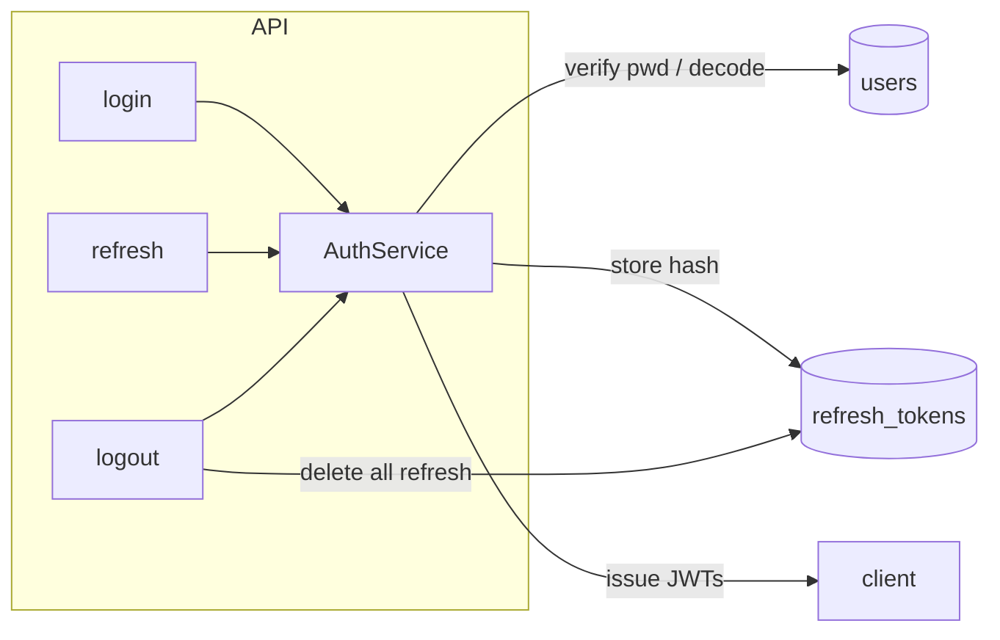
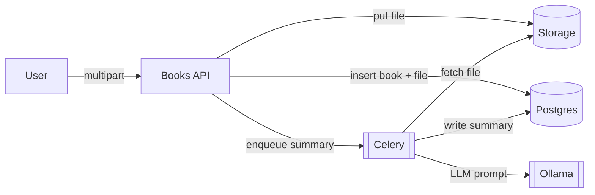
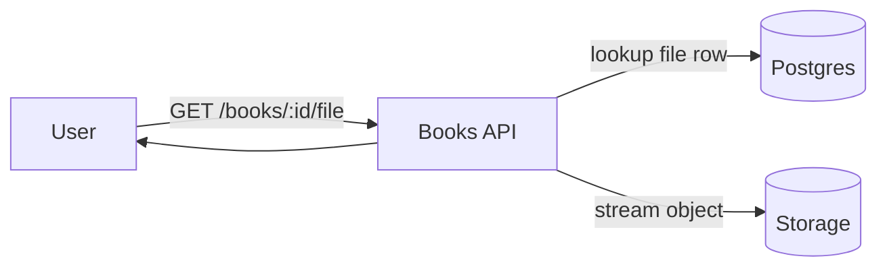
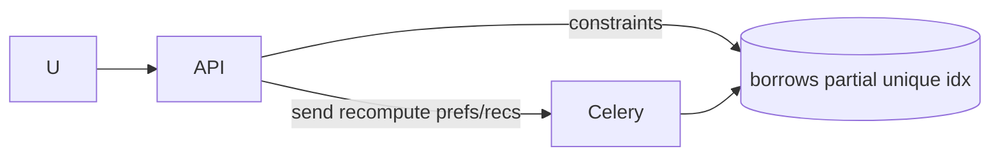
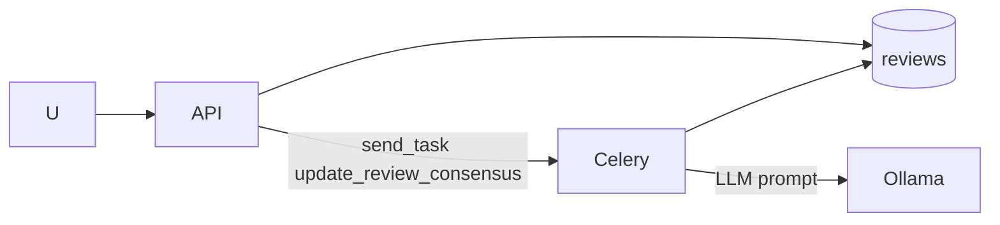
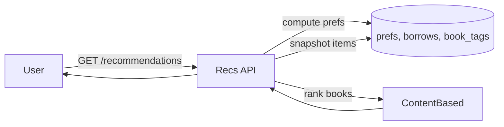

# API & Service Design (LuminaLib)

This doc gives endpoint-by-endpoint intent, data flow, and visuals so we can resume quickly.

## Legend for Diagrams
- Rectangles = components, Cylinders = DB, Parallelograms = storage, Hexagon = Celery worker, Cloud = Ollama.

---

## Auth
**Endpoints**  
- `POST /api/auth/signup` – create user, returns 201/400.  
- `POST /api/auth/login` – form login, returns access+refresh tokens.  
- `POST /api/auth/refresh` – rotates refresh (revokes old, issues new).  
- `POST /api/auth/logout` – revokes all refresh tokens for the user.  
- `GET /api/auth/profile` – returns current user (access token required).

**Flow (login/refresh/logout)**  

---

## Books (Upload + Download)
**Endpoints**  
- `POST /api/books` (multipart) – create book, store file, enqueue summary.  
- `GET /api/books` – list (with file meta & tags).  
- `PUT /api/books/{id}` – update fields, optional file replace (re-summary).  
- `DELETE /api/books/{id}` – delete book.  
- `GET /api/books/{id}/file` – download stored file (auth, 404 if missing).

**Validation**  
- MIME allowlist: pdf|txt.  
- Size cap: `MAX_UPLOAD_MB` → 413 if exceeded.  
- Duplicate ISBN → 400.

**Flow (upload & summary enqueue)**  

**Flow (download)**  

---

## Borrow / Return
**Endpoints**  
- `POST /api/books/{id}/borrow` – one active borrow per user & per book.  
- `POST /api/books/{id}/return` – sets `returned_at`, 404 if not active.

**Flow**  

---

## Reviews & Analysis
**Endpoints**  
- `POST /api/books/{id}/reviews` – only borrowers can review; 1/user/book.  
- `GET /api/books/{id}/reviews` – list.  
- `GET /api/books/{id}/analysis` – returns summary + review consensus (if ready), 404 if neither exists.

**Flow (review -> consensus)**  

---

## Recommendations (Content-Based)
**Endpoint**  
- `GET /api/recommendations`

**Scoring Logic**  
- Tags on books (comma-separated).  
- User preference weight per tag = count of borrows of books with that tag.  
- Score(book) = sum of user tag weights across that book’s tags.  
- Exclude already-borrowed books.  
- If no tags/borrows → empty list + hint.

**Flow**  

---

## Metrics & Logging
- Endpoint: `GET /metrics` (Prometheus).  
- Counters: Celery task success/failure/retry.  
- Logging: JSON (python-json-logger) in API & worker.

---

## Testing Guide (summary)
- Stack running: `docker compose exec api pytest -q`  
- Host: `pytest -q` (needs DB/Redis env).  
- Coverage: auth rotation/logout, upload validation, download, borrow/return, recommendations “no signal”, health. See `tests/test_features.py`.

---

## Storage Providers
- MinIO (default) or local (dev/tests). Both support streaming `get_stream` used by download endpoint.
