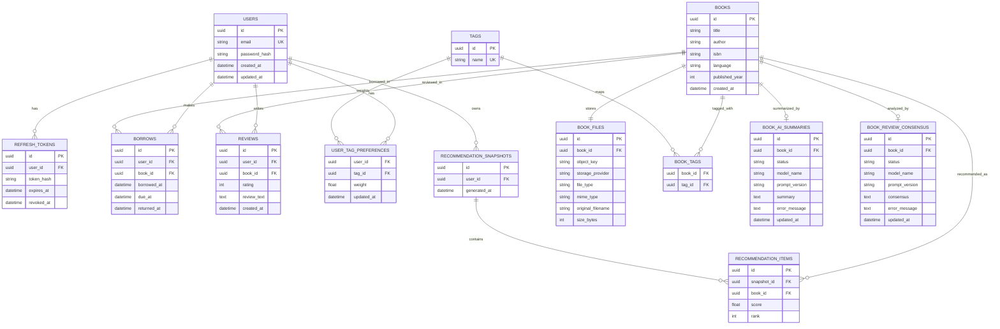

# LuminaLib Diagrams

## 1) ER Diagram

## 2) High-Level Architecture (Block Line Diagram)

## 3) Async Event Flow (Reference)

## 4) Endpoint -> Tables Touched

| Endpoint | Reads | Writes/Updates |
|---|---|---|
| `POST /auth/signup` | - | `USERS` |
| `POST /auth/login` | `USERS` | `REFRESH_TOKENS` |
| `GET /auth/profile` | `USERS` | - |
| `POST /auth/logout` | `REFRESH_TOKENS` | `REFRESH_TOKENS` (revoke) |
| `POST /books` | - | `BOOKS`, `BOOK_FILES` |
| `GET /books` | `BOOKS`, `BOOK_FILES` | - |
| `PUT /books/{id}` | `BOOKS`, `BOOK_FILES` | `BOOKS` (metadata), optionally `BOOK_FILES` (file replace) |
| `DELETE /books/{id}` | `BOOKS`, `BOOK_FILES` | `BOOKS` + dependent rows (file/text/ai/tags) |
| `POST /books/{id}/borrow` | `BOOKS`, `BORROWS` | `BORROWS` |
| `POST /books/{id}/return` | `BORROWS` | `BORROWS` (returned_at) |
| `POST /books/{id}/reviews` | `BORROWS` | `REVIEWS` |
| `GET /books/{id}/analysis` | `BOOK_REVIEW_CONSENSUS`, `BOOK_AI_SUMMARIES` | - |
| `GET /recommendations` | `RECOMMENDATION_SNAPSHOTS`, `RECOMMENDATION_ITEMS`, `BOOKS` | - |

Worker tasks (triggered asynchronously):

| Task | Reads | Writes/Updates |
|---|---|---|
| `summarize_book(book_id)` | `BOOK_FILES` + storage bytes | `BOOK_AI_SUMMARIES` |
| `update_review_consensus(book_id)` | `REVIEWS` | `BOOK_REVIEW_CONSENSUS` |
| `recompute_user_preferences(user_id)` | `BORROWS`, `BOOK_TAGS` | `USER_TAG_PREFERENCES` |
| `recompute_recommendations(user_id)` | `USER_TAG_PREFERENCES`, `BOOK_TAGS`, `BORROWS` | `RECOMMENDATION_SNAPSHOTS`, `RECOMMENDATION_ITEMS` |
